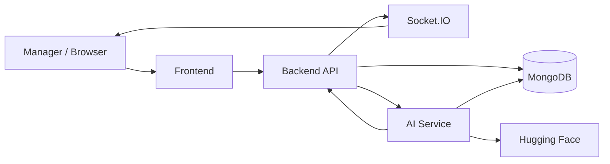
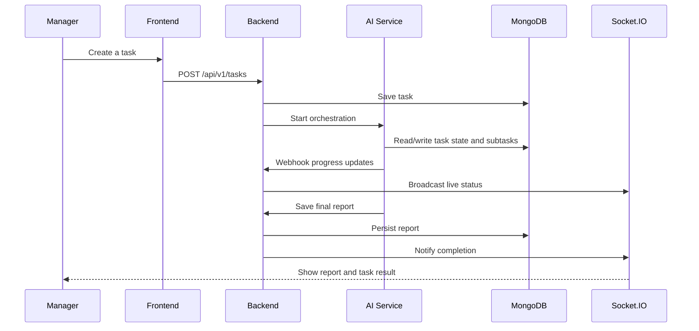

# SyncSpace

SyncSpace is an AI-powered task orchestration platform. A manager creates a task, the backend stores it, the AI service breaks the work into specialist steps, and the team gets live progress plus a final report.

## What This App Does

- Public landing page for the product story and onboarding entry points.
- Secure auth flow for sign-up and login.
- Task workspace for creating, tracking, and reviewing work.
- AI orchestrator that coordinates specialist agents.
- Live task updates through Socket.IO.
- Final reports saved back into the backend and linked to the original task.

## Architecture

```text
syncspace/
├── frontend/   React + Vite + Tailwind + Socket.IO client
├── backend/    Node.js + Express + MongoDB + Socket.IO
└── ai/         Python + FastAPI + Hugging Face + MongoDB
```

### Service Map



### Repository Layout

- `frontend/` holds the public landing page, auth pages, dashboard, task manager, agent monitor, and reports.
- `backend/` owns auth, task, report, repository, middleware, and Socket.IO server logic.
- `ai/` contains the orchestrator, specialist agents, workflow routes, and model/service integration.

## Screenshots

### Landing Page


### How It Works


### Operations View


## User Flow Diagram



## Run With Docker

Docker is the recommended way to run the full stack.

### 1. Create the environment files

Create these files before starting the stack:

```text
backend/.env
ai/.env
frontend/.env
```

Minimum example values:

```env
MONGO_URI=mongodb://mongodb:27017/syncspace_dev
REDIS_URL=redis://redis:6379
AI_SERVICE_URL=http://ai:8000
BACKEND_URL=http://backend:3000
FRONTEND_URL=http://localhost:5173
INTERNAL_WEBHOOK_SECRET=change_me_to_the_same_value_in_backend_and_ai
HUGGINGFACE_API_KEY=hf_your_key_here
VITE_API_BASE_URL=http://localhost:3000/api/v1
VITE_SOCKET_URL=http://localhost:3000
VITE_AI_URL=http://localhost:8000
```

Important notes:

- Keep `INTERNAL_WEBHOOK_SECRET` identical in `backend/.env` and `ai/.env`.
- `HUGGINGFACE_API_KEY` is required for real AI output.
- MongoDB and Redis are already provided by `docker-compose.yml`.

### 2. Start everything

```powershell
docker compose up --build
```

### 3. Open the app

- Frontend: http://localhost:5173
- Backend health: http://localhost:3000/health
- AI health: http://localhost:8000/health

### 4. Useful Docker commands

```powershell
docker compose logs -f backend
docker compose logs -f ai
docker compose ps
docker compose down
```

## Core Flow

1. A manager lands on the public site and enters the workspace.
2. The frontend sends a task to the backend API.
3. The backend saves the task in MongoDB and triggers the AI service.
4. The AI orchestrator splits the task into specialist work.
5. Progress updates are pushed back through internal webhooks and Socket.IO.
6. The final report is saved and attached to the task.
7. The manager reviews the completed result in the reports area.

## Key API Routes

### Backend

| Method | Path | Description |
|--------|------|-------------|
| POST | `/api/v1/auth/register` | Register |
| POST | `/api/v1/auth/login` | Login |
| GET | `/api/v1/auth/profile` | Current profile |
| POST | `/api/v1/tasks` | Create and queue task |
| GET | `/api/v1/tasks` | List tasks |
| GET | `/api/v1/tasks/stats` | Dashboard stats |
| GET | `/api/v1/tasks/:id` | Task details |
| DELETE | `/api/v1/tasks/:id` | Delete task |
| POST | `/api/v1/tasks/:taskId/subtask-update` | Internal AI webhook |
| GET | `/api/v1/reports` | List reports |
| GET | `/api/v1/reports/task/:taskId` | Report by task |
| GET | `/api/v1/reports/:id` | Report details |
| POST | `/api/v1/reports/task/:taskId/save` | Internal AI webhook |

### AI Service

| Method | Path | Description |
|--------|------|-------------|
| GET | `/health` | Health check |
| POST | `/api/tasks/process` | Start AI processing |
| GET | `/api/tasks/:taskId/status` | Processing status |

## Socket Events

| Event | Direction | Description |
|-------|-----------|-------------|
| `join:task` | Client -> Server | Subscribe to task updates |
| `task:queued` | Server -> Client | Task accepted |
| `task:processing` | Server -> Client | Orchestrator started |
| `task:progress` | Server -> Client | Live progress update |
| `task:completed` | Server -> Client | Work finished |
| `task:failed` | Server -> Client | Error occurred |
| `subtask:completed` | Server -> Client | Single specialist finished |
| `report:ready` | Server -> Client | Report available |

## Notes

- If you add more screenshots, place them in a docs or assets folder and replace the image links above.
- Docker Compose is the primary way to run the stack in this repo.
- Keep database and API credentials out of version control.
